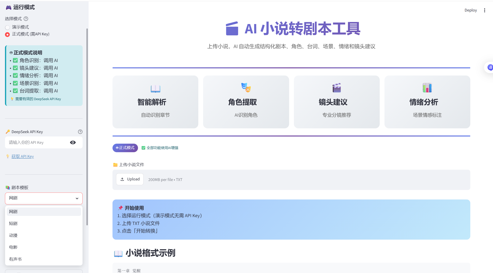
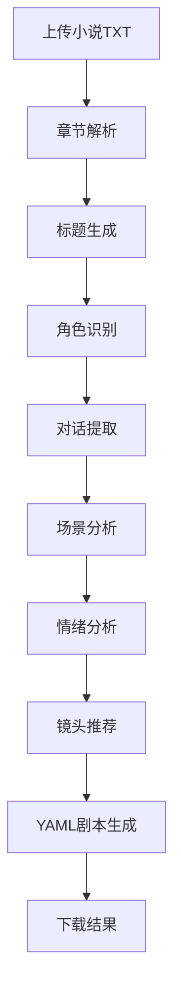

 📖 AI 小说转剧本工具

[](https://www.python.org/)
[](https://streamlit.io/)
[](#)
[](LICENSE)

> 基于 DeepSeek AI 的小说转剧本生成系统

将小说内容自动转换为结构化剧本，支持角色识别、场景分析、情绪分析、镜头推荐以及 YAML 剧本导出。


🚀 在线体验

项目已部署至 Streamlit Community Cloud。

👉 在线地址：

```text
https://xengineer-ai-script-generator.streamlit.app/
```
 🎬 Demo 演示视频

📺 在线演示：

[点击观看 Demo 视频](https://www.bilibili.com/video/BV1DtE46CEJe?vd_source=42a4e1a54b5c7bca2fa1103c1473d617)


🖥️ 系统截图


```text
img.png
```



 ✨ 功能特性：

 小说章节解析
 自动识别章节结构
 自动提取章节内容
 自动生成章节标题

 多种剧本模板
 支持：
 网剧
 动漫
 电影
 有声书

AI角色识别
 自动分析：
 主要角色
 出场人物
 人物信息提取

对话提取

自动识别：

 人物对白
 发言角色
 对话内容

AI场景分析

自动分析：

 时间
 地点
 环境描述
 场景切换

AI情绪分析

支持识别：

 喜悦
 悲伤
 紧张
 愤怒
 恐惧
 平静
 等情绪状态。

 AI镜头推荐

自动推荐：

 远景
 全景
 中景
 近景
 特写
等影视镜头。

YAML剧本生成

输出标准 YAML 格式：

 易编辑
 易扩展
 易集成


🔄 工作流程


🏗️ 项目结构

```text
XEngineer-AI-script-generator/
│
├── ai/
│   ├── __init__.py
│   ├── deepseek_client.py
│   └── prompt_builder.py
│
├── data/
│   └── example.txt
│
├── utils/
│   ├── __init__.py
│   └── parser.py
│
├── .gitignore
├── app.py
├── config.py
├── main.py
├── output.yaml
├── README.md
├── requirements.txt
├── script_generator.py
├── status
├── templates.py
└── img.png
```


 📦 技术栈

| 技术           | 说明      |
| ------------ | ------- |
| Python       | 核心开发语言  |
| Streamlit    | Web界面开发 |
| DeepSeek API | AI分析能力  |
| Requests     | HTTP请求  |
| PyYAML       | YAML生成  |
| Pandas       | 数据处理    |
| Plotly       | 数据可视化   |


🛠️ 本地运行

 安装依赖

```bash
pip install -r requirements.txt
```

配置 API Key

创建环境变量或配置：

```env
DEEPSEEK_API_KEY=your_api_key
```

 启动项目

```bash
streamlit run app.py
```

访问：

```text
http://localhost:8501
```


 📖 使用说明

 第一步

上传 TXT 小说文件

第二步

选择剧本模板：

 网剧
 动漫
 电影
 有声书

 第三步

点击：

```text
生成剧本
```

 第四步

系统自动完成：

 章节解析
 标题生成
 角色识别
 对话提取
 场景分析
 情绪分析
 镜头推荐

 第五步

下载 YAML 剧本文件


 📄 示例输出

```yaml
chapter_1:
  title: 初次相遇

  scenes:
    - location: 咖啡厅

      characters:
        - 李明
        - 小雨

      emotion: 激动

      camera:
        - 中景
        - 特写

      dialogue:
        - 李明: 你好，很高兴认识你。
        - 小雨: 我也是。
```


❓ 常见问题

为什么生成较慢？

AI分析依赖 DeepSeek API。

文本越长：

 分析时间越长
 Token消耗越多

属于正常现象。

 角色识别不准确怎么办？

建议：

 上传完整章节
 使用规范的人物名称
 提供更多上下文

 无法生成结果怎么办？

请检查：

 API Key 是否正确
 网络连接是否正常
 DeepSeek 服务是否可用


🔮 后续优化方向

 PDF导出
 Word导出
 分镜脚本生成
 角色关系图谱
 AI配音脚本
 多模型支持


 👨‍💻 作者

XEngineer

AI Script Generator


 📜 License

MIT License
